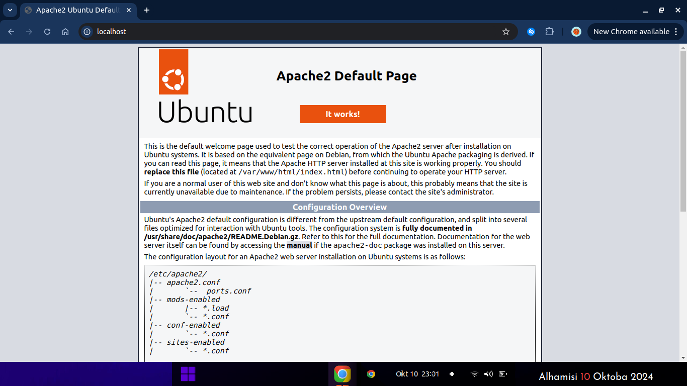
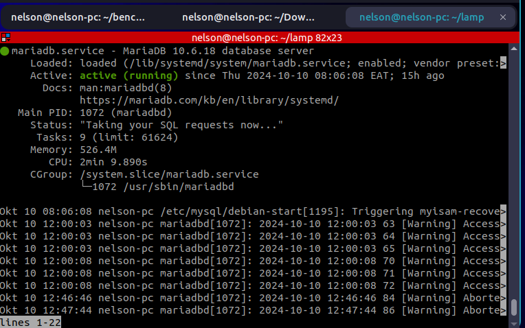
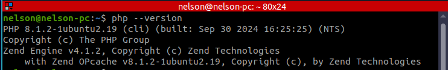
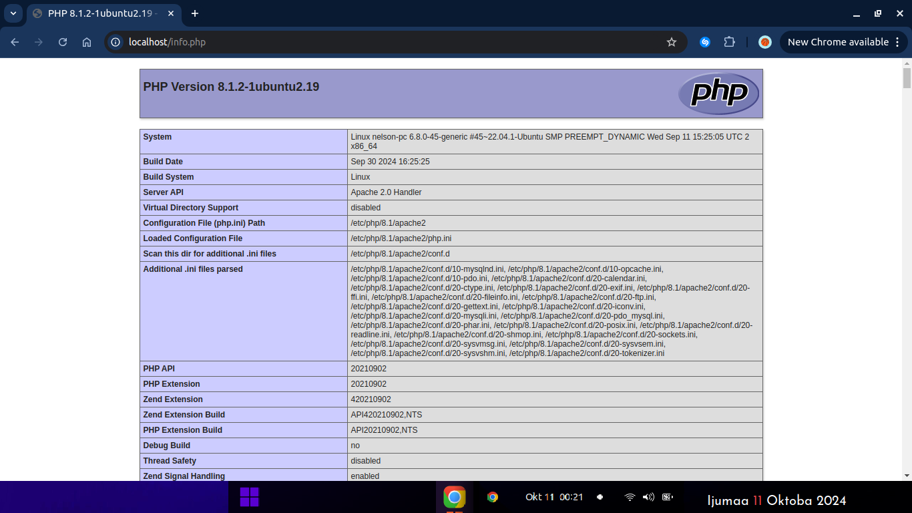

# LAMP Stack Installation and Configuration on Ubuntu

## Introduction

This guide provides a step-by-step process for installing and configuring the LAMP (Linux, Apache, MySQL/MariaDB, PHP) stack on Ubuntu. The LAMP stack is essential for hosting dynamic websites and web applications. We will also cover how to configure and test the installation by creating a database, writing PHP scripts, and managing backups.

## **Prerequisites**

To proceed with the installation and configuration of the LAMP stack on Ubuntu, ensure you meet the following prerequisites:

**Operating System** :

* A server instance running Ubuntu 22.04 LTS or Ubuntu 24.04.
* Ensure your system is up to date with the latest patches and updates.

**Non-root User with Sudo Privileges** :

* You must have a non-root user configured with sudo privileges to manage software installations and configurations.

**Basic Firewall Setup (UFW)** :

* Ensure the **Uncomplicated Firewall (UFW)** is configured, allowing HTTP (port 80) and HTTPS (port 443) traffic.
* If UFW is not installed, you can install and configure it using:

```bash
sudo apt install ufw
sudo ufw enable
sudo ufw allow OpenSSH
```

**Public IP Address** :

* If you are working on a remote server, ensure that you have the public IP address of the server to access the web services after the LAMP stack is installed.
* 

## **1. Installing the LAMP Stack**

### **Step 1: Install Apache (Web Server)**

Apache is the web server software responsible for serving web pages. Follow these steps to install and configure Apache:

* **Update the package manager cache** :

```bash
sudo apt update
```

* **Install Apache** :

```bash
sudo apt install apache2 -y
```

* **Enable and start Apache** :

```bash
sudo systemctl enable apache2
sudo systemctl start apache2
```

* **Verify Apache installation** :
  * Open a browser and navigate to `http://localhost` or `http://your-server-ip`. You should see the default Apache page.



### **Step 2: Install MySQL or MariaDB (Database Server)**

You can use either MySQL or MariaDB. For this task, we'll install  **MariaDB** :

* **Install MariaDB** :

```bash
sudo apt install mariadb-server mariadb-client -y
```

* **Secure MariaDB** :
  Run the built-in security script to remove weak defaults:

```bash
sudo mysql_secure_installation
```

* Follow the prompts to set a root password, remove anonymous users, disallow remote root login, and remove the test database.
* **Verify MariaDB installation** :

```bash
sudo systemctl status mariadb
```



### **Step 3: Install PHP (Scripting Language)**

PHP is needed to generate dynamic content and interact with the database.

* **Install PHP** :

```bash
sudo apt install php libapache2-mod-php php-mysql -y
```

* **Verify PHP installation** :

```bash
php --version
```



### **Step 4: Test PHP with Apache**

To ensure PHP is working properly with Apache:

* **Create a test PHP file** :

```bash
sudo nano /var/www/html/info.php
```

   Add the following content to the file

```php
<?php
phpinfo();
?>
```

* **Test PHP in the browser** :
  * Navigate to `http://localhost/info.php` or `http://your-server-ip/info.php` in your browser. You should see the PHP info page.



## **2. Configuration and Testing**

### **Step 1: Create a Sample Database in MariaDB**

To test the LAMP stack with a database, follow these steps to create a database and table in MariaDB:

* **Log in to MariaDB** :

```bash
sudo mysql -u root -p
```

* **Create a database and table** :

```sql
CREATE DATABASE test_db;
USE test_db;
CREATE TABLE users (
    id INT AUTO_INCREMENT PRIMARY KEY,
    name VARCHAR(50),
    email VARCHAR(50)
);
```

### Step 2: Insert Sample Data and Display It

*  **Select the Database** :
  Once you're logged in, select the `test_db` database where the `users` table is located:

```sql
USE test_db;
```

* **Insert data into the `users` table** :

```bash
INSERT INTO users (name, email) VALUES ('John Doe', 'john@example.com'), ('Jane Smith', 'jane@example.com');
```

*  **Verify the Insert** :
  You can check that the data was inserted correctly by running:

```sql
SELECT * FROM users;
```

*  **Exit MariaDB** :

```sql
EXIT;
```

* **Create a PHP script to retrieve and display data** :

```bash
sudo nano /var/www/html/users.php
```

* Add the following code:

```php
<?php
$servername = "localhost";
$username = "root"; // Update if necessary
$password = "your_password"; // Use your root password
$dbname = "test_db";

$conn = new mysqli($servername, $username, $password, $dbname);

if ($conn->connect_error) {
    die("Connection failed: " . $conn->connect_error);
}

$sql = "SELECT id, name, email FROM users";
$result = $conn->query($sql);

if ($result->num_rows > 0) {
    while($row = $result->fetch_assoc()) {
        echo "id: " . $row["id"]. " - Name: " . $row["name"]. " - Email: " . $row["email"]. "<br>";
    }
} else {
    echo "0 results";
}
$conn->close();
?>

```

* Navigate to `http://localhost/users.php` or `http://your-server-ip/users.php`.
